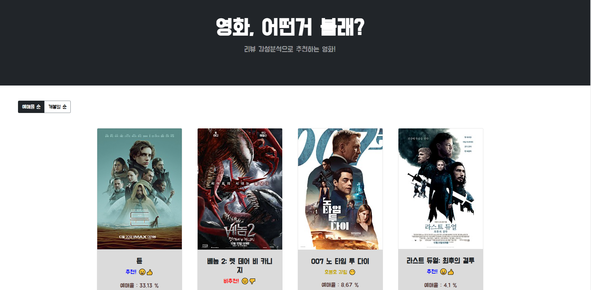
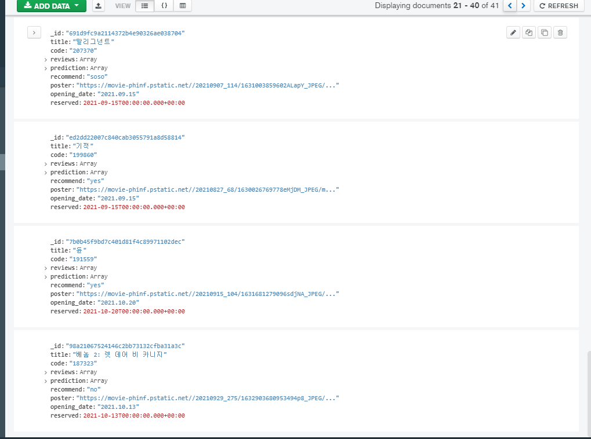

- 개인 프로젝트
- 2021.09 ~ 2021.09

# 프로젝트 소개

네이버 영화에 남긴 리뷰들이 긍정적이라면 추천, 그렇지 않으면 비추천하는 웹 어플리케이션 제작

## 1. 리뷰 감성 분석

- 네이버 영화 리뷰를 크롤링한 데이터 사용 ([데이터](https://github.com/e9t/nsmc))
- 위의 20만개의 데이터를 바탕으로 Tensorflow를 사용해 감성분석 모델 구축
    - 100개의 리뷰를 테스트하여 예측치를 저장
    - 85%의 정확도
    - DNN과 LSTM비교했을 때 성능의 차이가 거의 없어서 DNN 사용

## 2. 웹 어플리케이션

- 현재 상영중인 영화 20편의 추천 여부를 보여준다
    - 예매율순, 개봉일순으로 정렬 가능
    - scraping을 통해 현재 상영중인 영화 정보를 불러옴
    - 100개의 리뷰 중 60개 이상 긍정이면 추천, 40개 미만 긍정이면 비추천
    
    
 

- 보고싶은 영화를 검색하여 추천인지 아닌지 보여준다
- 각 영화의 추천/비추천 리뷰를 3개씩 보여준다
- 웹에서 크롤링한 정보를 MongoDB에 저장하고 웹앱에서 불러와 사용한다

# 어려웠던 점

- NoSQL인 MongoDB를 처음 사용하면서 SQL처럼 만들어서 collection을 여러개 만들고 시작했지만 이 프로젝트에서는 하나의 collection에 모든 정보를 다 저장해도 상관없다는 것을 깨달았다
- 정적 크롤링을 통해 빠르게 영화 정보를 수집하더라도 기존에 DB에 저장하지 않은 영화가 있다면 100개의 리뷰의 sentiment를 모델을 통해 테스트해야 하기 때문에 시간이 오래 걸림
    - 이 부분은 해결하지 못한 부분이다. 일정 시간마다 (예를 들면 사용자가 적을 시간) DB업데이트를 해서 축적된 데이터를 늘리는 것이 좋을 것 같다
    - 프리 티어에 해당하는 학생계정을 사용하기 때문에 AWS에서 GPU를 사용할 수 없었고 결국 해결하지 못한 부분이다
    - 결국 로컬에서만 사용할 수 밖에 없다.
- 정확한 영화 제목을 쓰지 않으면 부정확한 결과를 얻게 된다. 예를 들어 어벤저스라는 제목의 시리즈가 여러개 있지만 정확한 풀네임을 넣지 않으면 원하는 결과를 얻을 수 없다

# 성과

- 인터넷에서 원하는 정보를 크롤링하여 데이터베이스에 저장할 수 있다
- API가 없었지만 정적 크롤러를 사용해 원하는 정보를 추출할 수 있다
- Flask를 사용해 웹 어플리케이션을 만들었다
    - Front-end 부분은 Bootstrap을 사용했다